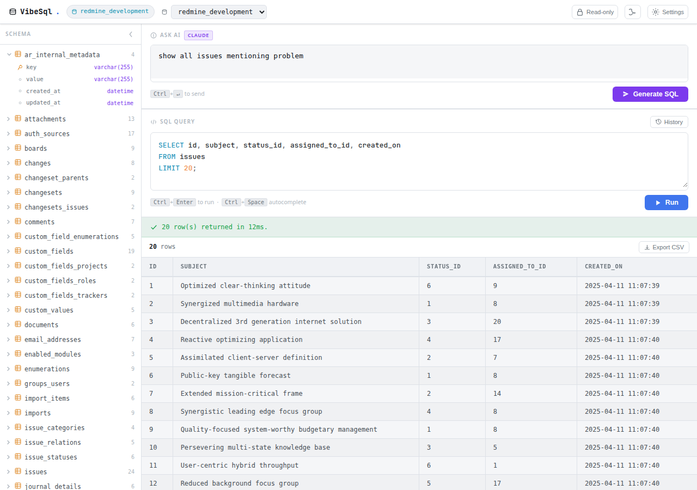
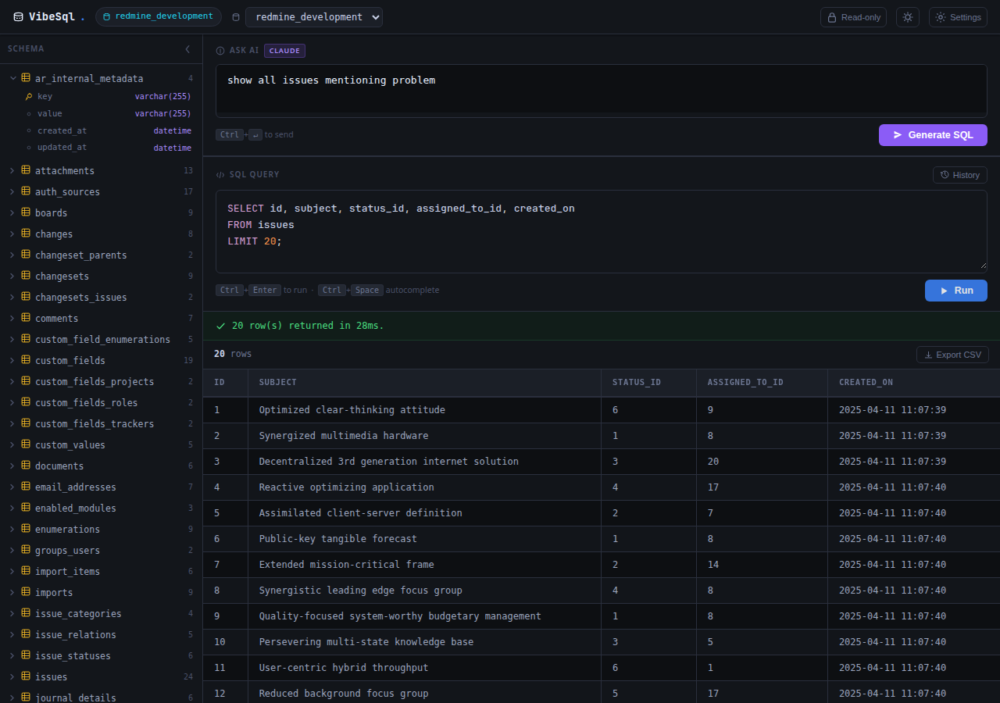
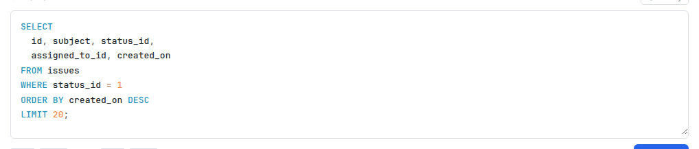
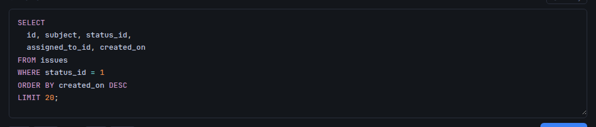
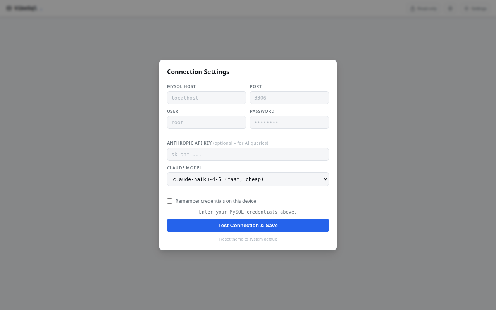
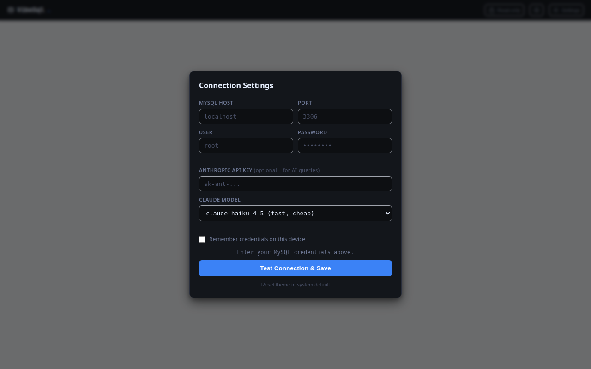

# VibeSql

A single small PHP file that turns any MySQL database into an AI-powered query interface. Drop one file on your server, open it in a browser, and start asking questions in plain English — VibeSql uses the Claude API to understand your database schema and write the SQL for you.






## How it works

1. **Open the app** — a settings modal appears on first run
2. **Enter your MySQL credentials** — host, user and password are tested before saving
3. **Select a database** — VibeSql loads the full schema into the sidebar
4. **Ask in plain English** — type something like *"show all open issues assigned to someone, sorted by date"* and click **Generate SQL**
5. **Review and run** — the generated SQL appears in the editor; press **Run** or `Ctrl+Enter` to execute
6. **Results appear as a table** — with horizontal scroll for wide result sets




## Features

- **Single file** — everything is in `index.php`. No composer, no npm, no build step.
- **AI SQL generation** — describe what you want, Claude writes the query using your actual schema as context
- **SQL syntax highlighting** — PrismJS (SQL grammar, light and dark themes) is embedded directly in `index.php` with no CDN calls (see [Supply-chain safety](#supply-chain-safety))
- **Schema sidebar** — browse all tables and columns at a glance
- **Dark / light theme** — follows your OS preference automatically; toggle manually at any time
- **Secure credential storage** — host and user saved in `localStorage`; password and API key in `sessionStorage` only (cleared when the tab closes)
- **CSRF protection** — every API call is validated server-side against a session token; the endpoint rejects requests from any other origin
- **SQL safety checks** — blocks `INTO OUTFILE`, `LOAD_FILE`, UDFs, and other file/exec primitives

## Requirements

- PHP 8.1+ with the `mysqli` extension
- MySQL / MariaDB
- A web server (Apache, Nginx) or `php -S localhost:8080`

## Setup

```bash
# Clone or download
git clone https://github.com/acosonic/vibesql.git
cd vibesql

# Serve with the built-in PHP server
php -S localhost:8080
```

Then open `http://localhost:8080` in your browser. On first load the settings modal appears — enter your MySQL credentials and optionally an Anthropic API key for AI queries.

## Keyboard shortcuts

| Shortcut | Action |
|---|---|
| `Ctrl+Enter` in SQL editor | Run query |
| `Ctrl+Enter` in AI input | Generate SQL |
| `Escape` | Close settings modal |

## Security notes

- Passwords and API keys live in **sessionStorage** — cleared automatically when the browser tab closes
- All API requests carry a session CSRF token — the PHP endpoint rejects anything without a valid token
- `mysqli::query()` runs a single statement only — stacked queries (`;DROP TABLE`) are not possible
- Dangerous SQL patterns (`INTO OUTFILE`, `LOAD_FILE`, `sys_exec`, etc.) are blocked before execution

## Supply-chain safety

VibeSql loads **zero external resources at runtime**. No CDN, no third-party scripts, no remote fonts.

The SQL syntax highlighter uses [PrismJS](https://prismjs.com/) — but instead of loading it from a CDN like `cdn.jsdelivr.net` or `cdnjs.cloudflare.com`, the minified source of `prism.min.js`, `prism-sql.min.js`, `prism-coy.css` (light theme), and `prism-tomorrow.css` (dark theme) is pasted directly inside `index.php`.

**Why this matters:** a CDN-hosted script can be silently replaced or tampered with at any time. If you drop VibeSql on a server that handles real credentials, a compromised CDN could inject code that exfiltrates your database password or API key. By embedding all JavaScript and CSS verbatim, the only thing that runs in the browser is exactly what you can read in the file you deployed.

To verify or update the embedded Prism build:

```bash
# Download fresh copies and diff against what is in index.php
curl -s https://cdnjs.cloudflare.com/ajax/libs/prism/1.29.0/prism.min.js > /tmp/prism.min.js
curl -s https://cdnjs.cloudflare.com/ajax/libs/prism/1.29.0/components/prism-sql.min.js > /tmp/prism-sql.min.js
```

Then compare the content of those files against the `<script>` blocks in `index.php`.

## Reporting security issues

If you find a security vulnerability, please **do not** open a public issue. Instead, [open a GitHub issue](https://github.com/acosonic/vibesql/issues/new) marked as **Security** and describe the problem. Include steps to reproduce and, if possible, a suggested fix.

For general bugs, feature requests, or questions — [open an issue](https://github.com/acosonic/vibesql/issues/new) on GitHub.
